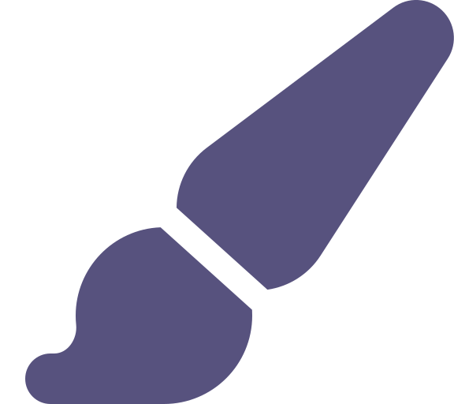
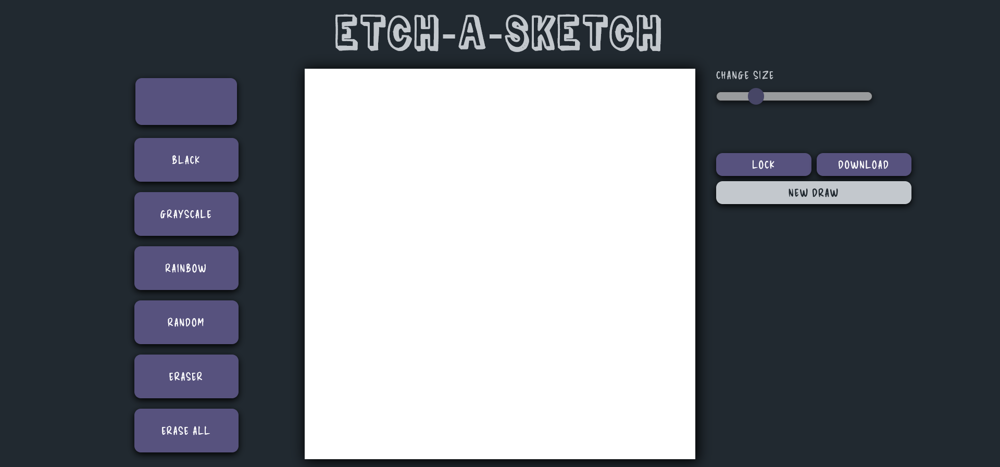

    <h1>
        
        <a href="https://spectacular-torte-2fa425.netlify.app/">Etch A Sketch</a>
    </h1>
    <h4><b>4th assignment of <a href="https://www.theodinproject.com" target="_blank">The Odin Project</a></b></h4>

### 

This project had the aim of applying basic Javascript knowledge and to learn how to lookup information and how to ask yourself the right questions to search for answers.

After all, I think that you don't need to know every little thing of programming languages and logical concepts; however, it is necessary to know what you're doing and what you want to achieve, and when you don't remember which method or library you should use, just look it up. My best allies in those cases are most frecuently [Google](https://www.google.com), [StackOverflow](https://stackoverflow.com/) and cases studies articles from [Medium](https://medium.com/).

In this project, etch-a-sketch, it is simply an UI where the user can drag the mouse to draw anything and choose different colors. The interface also allows to erase some parts or all the drawing, and to change the size of the pixels of the sketch, going from a grid of 2x2 pixels up to one of 64x64.

Moreover, I thought of an original feature that could be implemented, and I figured that aggregating an option of downloading the drawing as a picture could be interesting!

If you're interested in the implementation of this project or the stack used, keep reading!

# Table of contents

# Tech stack
This project follows a basic web development stack:

* 
* 
* 
  
## Libraries used
Besides the main stack, I used [html2canvas](https://github.com/niklasvh/html2canvas) library in order to capture the grid of the draw and convert it to a canvas element so that it can be downloaded.

# Detailed Implementation
## Design
Two general designs were made. I created the first one for larger screens like desktops or tablets; while the second design was adapted to smallest screens as phone devices.

The desktop-based design have a main grid that contains the drawing part. On each side, there are different buttons to choose between colors, eraser, size and to download the sketch.

On the other hand, for the mobile design, I thought that it would be a better idea to adapt the drawing to the entire screen. In this case, the buttons are on top and on the right of the screen, above the drawing grid, and the explanatory text of the buttons is replaced by icons.

### Colors
Three colors were used in this project:
*  `#57527e` &rarr; buttons
*  `#212930` &rarr; background
*  `#c3c8cd` &rarr; text
### Fonts
* [Zuka Doodle](https://www.fontspace.com/zuka-doodle-font-f35028) &rarr; free font for title
* [Delicious Handrawn](https://fonts.google.com/specimen/Delicious+Handrawn?query=delici) &rarr; text

## HTML

## CSS

## JS

## Responsiveness

# Launch

# Contribute

# Credits

