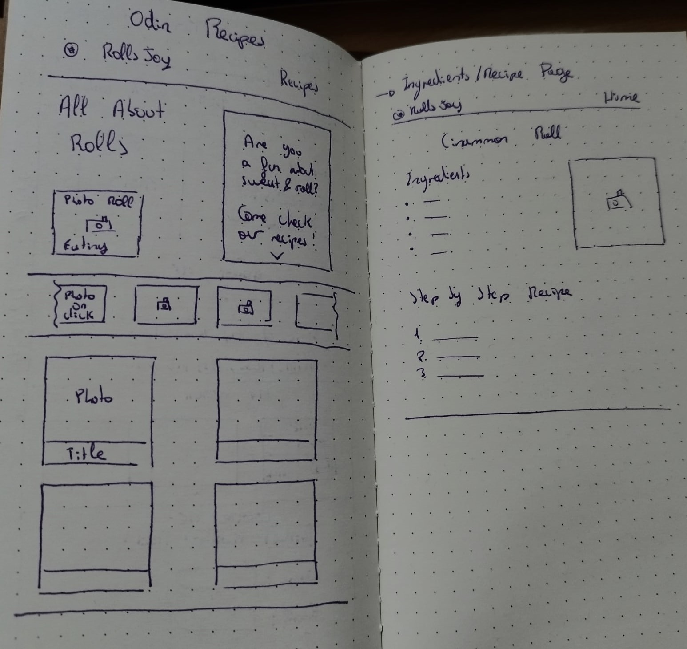

# The Odin's Recipes Project
This is the first project from The Odin curriculum. The objective is to practice HTML, CSS and the use of Git and Github.

It is a simple project in which the web page should contain some recipes pages and a home page. Also, all pages should contain some heading, unordered lists and ordered lists.

# My Project: Rolls Joy
Taking these assignments, I started making some designs. Since I already have some basic CSS knowledge, I wanted to practice also those skills and recreating some animation styles since I didn't know how to do them.

I first thought about this web idea of Rolls, like Cinnamon Rolls, New York Rolls (very famous here in Spain) and some other recipes; all of them should be roll desserts. The first design looked like this:

