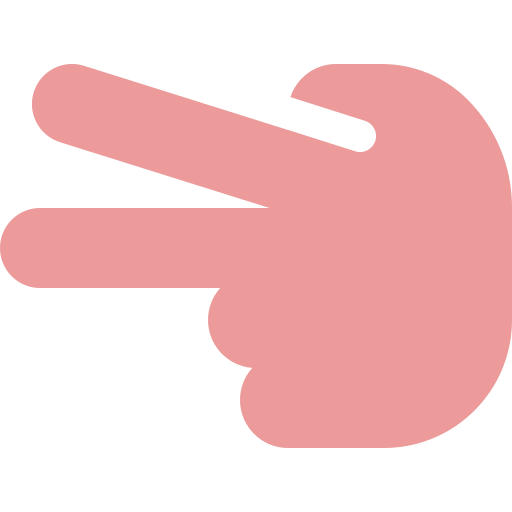
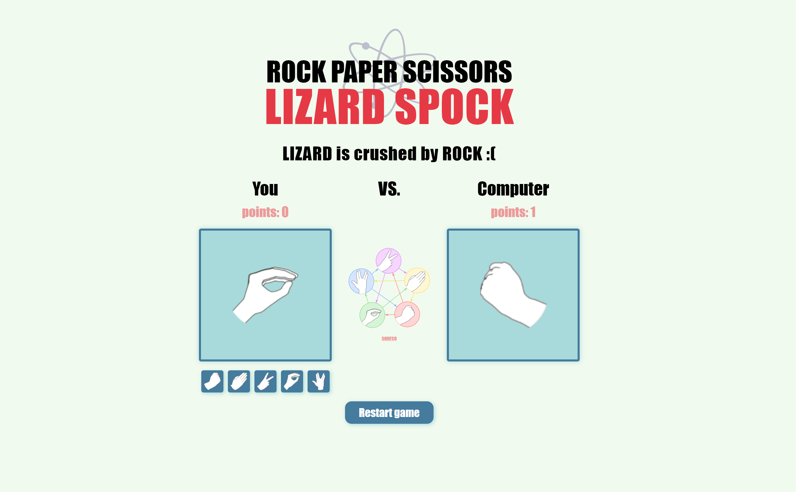

**

    <h1>
        
        <a href="https://spectacular-torte-2fa425.netlify.app/">Rock Paper Scissor Lizard Spock</a>
    </h1>
    <h4>
        <b>3rd assignment of <a href="https://www.theodinproject.com" target="_blank">The Odin Project</a></b>
    </h4>
    <h4>
        <a href="#tech-stack">Stack</a>
        •
        <a href="#motivation">Motivation</a>
        •
        <a href="#detailed-implementation">Implementation</a>
        •
        <a href="#credits">Credits</a>
    </h4>
    <h4>
        
        
        
    </h4>

<section class="introduction" id="introduction">
    
    

        
In this project, the main objective was to code with Javascript and make a basic rock, paper and scissors game.

        
The game could have the rules anyone wanted, so in order to make it more interesting I decided to make a harder version of the game, which is rock, paper, scissors, lizard, spock from The Big Bang Theory show

        
With the basic knowledge of JavaScipt, I was able to implement those basic functions to make the game

        
Once the game was correctly running, I made a simple UI to create a visual interface so that a user could play against the computer

        
The UI consist of five possible choices for the user at the same time that the computer randomly picks one. In the middle of the interface, the user can click on the picture to see the rules. The first player that gets to 5 win the entire game and can restart a new one

        
If you're interested in the implementation of this project or the stack used, keep reading!

    

</section>
<section class="container table" id="table-of-contents">
    <h1>Table of contents</h1>
    <ul>
        <li><a href="#table-of-contents">Table of contents</a></li>
        <li>
            <a href="#tech-stack">Tech Stack</a>
            <ul>
                <li><a href="#libraries-used">Libraries used</a></li>
            </ul>
        </li>
        <li><a href="#motivation">Motivation</a></li>
        <li>
            <a href="#detailed-implementation">Detailed Implementation</a>
            <ul>
                <li>
                    <a href="#design">Design</a>
                    <ul>
                        <li><a href="#colors">Colors</a></li>
                        <li><a href="#fonts">Fonts</a></li>
                    </ul>
                </li>
                <li>
                    <a href="#html">HTML</a>
                    <ul>
                        <li><a href="#highlights">Highlights</a></li>
                    </ul>
                </li>
                <li>
                    <a href="#css">CSS</a>
                    <ul>
                        <li><a href="#highlights-1">Highlights</a></li>
                    </ul>
                </li>
                <li><a href="#js">JS</a></li>
                <li><a href="#responsiveness">Resonsiveness</a></li>
            </ul>
        </li>
        <li><a href="#contribute">Contribute</a></li>
        <li><a href="#credits">Credits</a></li>
    </ul>
</section>
<section class="container stack" id="tech-stack">
    <h1>Tech Stack</h1>
    
This project follows a basic web development stack:

    <ul>
        <li></li>
        <li></li>
        <li></li>
    </ul>
</section>
<section class="container libraries" id="libraries-used">
    <h1>Libraries Used</h1>
    
Since it is a basic game, only pure Javascript was used in this project

</section>
<section class="container motivation" id="motivation">
    <h1>Motivation</h1>
    

        
As it was previously mentioned, the main motivation of this project is to keep on completing assignments of <a href="https://theodinproject.com">The Odin Project</a> and to practice on Javascript skills learnt.

        
This project is a good motivation to see the level of Javascript one has!

        
These kind of projects motivates me a lot, because the course gives the first guidelines to make a basic project, but you are also able to add more features and then having a full project designed from scratch and with your own ideas.

        
Moreover, I firstly took this project as a big challenge because I had no idea how to make the pixels painted according to the mouse events. But after reading other's people code, understanding it and searching for more documentation, I found myself capable of doing it. After completing this part, I thought about adding the downloading feature and I was in the same point again of having no clue about how to implement it. After some searches I found a library that could help in this implementation and I finally got it.

        
After all, the main motivation at the start of this project was to see basic guidelines with a blank document and thinking about making my own project from scratch. When I finished the project, it motivated me much more seeing me capable of understanding new concepts and applying them to my website.

    

</section>
<section class="container detailed" id="detailed-implementation">
    <h1>Detailed Implementation</h1>
    <section class="design" id="design">
        <h2>Design</h2>
        

            
Two general designs were made. I created the first one for larger screens like desktops or tablets; while the second design was adapted to smallest screens as phone devices.

            
The desktop-based design have a main grid that contains the drawing part. On each side, there are different buttons to choose between colors, eraser, size and to download the sketch.

            
On the other hand, for the mobile design, I thought that it would be a better idea to adapt the drawing to the entire screen. In this case, the buttons are on top and on the right of the screen, above the drawing grid, and the explanatory text of the buttons is replaced by icons.

        

        <section class="colors" id="colors">
            <h3>Colors</h3>
            
Three colors were used in this project:

            <ul>
                <li>
                    
                    #57527e
                    &rarr;
                    buttons
                </li>
                <li>
                    
                    #212930
                    &rarr;
                    background
                </li>
                <li>
                    
                    #c3c8cd
                    &rarr;
                    text
                </li>
            </ul>
        </section>
        <section class="fonts" id="fonts">
            <h3>Fonts</h3>
            <ul>
                <li><a href="https://www.fontspace.com/zuka-doodle-font-f35028">Zuka Doodle</a> &arr; free font for title</li>
                <li><a href="https://fonts.google.com/specimen/Delicious+Handrawn?query=delici">Delicious Handrawn</a> &arr; text</li>
            </ul>
        </section>
    </section>
    <section class="html" id="html">
        <h2>HTML</h2>
        
Basic HTML structure by creating containers for the part of the buttons of colors, another for the grid of the drawing, and a third for the other buttons that allows for more options on the sketch.

        <section class="highlights" id="highlights">
            <h3>Highlights</h3>
            <ul>
                <li>Use of input of type color to have a button to pick any color</li>
                <li>Use of input of type range to change the size of the grid</li>
            </ul>
        </section>
    </section>
    <section class="css" id="css">
        <h2>CSS</h2>
        
Used pure CSS to style each element by sleecting them by class or ID.

        <section class="highlights" id="highlights-1">
            <h3>Highlights</h3>
            <ul>
                <li>Use of flexbox and grid for different containers</li>
                <li>Change the content of the buttons according to the size of the screen</li>
            </ul>
        </section>
    </section>
    <section class="js" id="js">
        <h2>JS</h2>
        

            
Calls for different functions when clicking a button. Functions for setting the main color and grid size when an evet occurs.

            
 When the user clicks on the download button, an alert appears because the lock button must be clicked firstly. This is done because the lock button change the grid to a canvas element with the <a href="https://github.com/niklasvh/html2canvas">html2canvas</a> library, and then the download button takes this canvas and download it.

            
For the drawing part, the function listens when the mouse is over a pixel and if the mouse is clicked while it hovers, then the pixel is painted. A boolean variable is needed in this case, where it turns true when the user clicks on the mouse and false when the mouse is no longer clicked.

        

    </section>
    <section class="responsiveness" id="responsiveness">
        <h2>Responsiveness</h2>
        
The final result shows three different functional designs for desktop, tablet and mobile.

        

            
            
        

    </section>
</section>
<section clasS="container contribute" id="contribute">
    <h1>Contribute</h1>
    
If you liked my project and ideas or you think I could improve it, feel free to support my work or give me any advice by leaving me a message!

</section>
<section class="container credits" id="credits">
    <h1>Credits</h1>
    

        
        
    

</section>
