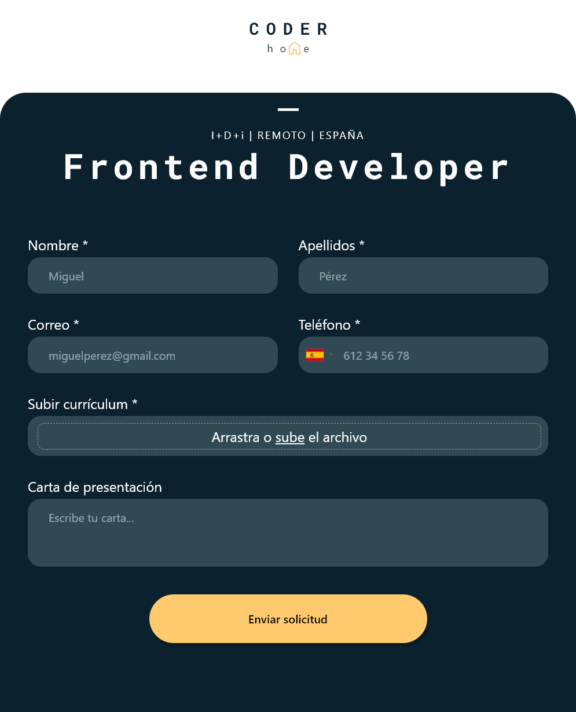

    <h1>
        
        <a href="https://spectacular-torte-2fa425.netlify.app/">Sign-up form</a>
    </h1>
    <h4>
        <b>This is a project assignment from The Odin course (Javascript path) -- https://www.theodinproject.com</a></b>
    </h4>
    <h4>
        <a href="#tech-stack">Stack</a>
        •
        <a href="#motivation">Motivation</a>
        •
        <a href="#detailed-implementation">Implementation</a>
        •
        <a href="#credits">Credits</a>
    </h4>
    <h4> <!-- tech stack images (https://github.com/Ileriayo/markdown-badges)  -->
        
        
        
        
    </h4>

### 

The aim of this project was to practice advanced HTML and CSS by making a form. The base case given by The Odin project was a sign-up form. However, since I'm actually applying for different jobs, I had the idea of making a different form. This project consist of a modal that appears and allows the user to fill the form. This form includes some required fields and different styles applied to each of them.

# Table of contents
- [Table of contents](#table-of-contents)
- [Tech stack](#tech-stack)
  - [Libraries used](#libraries-used)
- [Motivation](#motivation)
- [Detailed Implementation](#detailed-implementation)
  - [Design](#design)
    - [Colors](#colors)
    - [Fonts](#fonts)
  - [HTML](#html)
    - [Highlights:](#highlights)
  - [CSS](#css)
    - [Highlights:](#highlights-1)
  - [JS](#js)
  - [Responsiveness](#responsiveness)
- [Contribute](#contribute)
- [Credits](#credits)

# Tech stack
This project follows a basic web development stack:

* 
* 
* 
* 
  
## Libraries used

No libraries were used in this project, it was all made with pure JS since it is quite a simple project. However, I used an existing plugin because I wanted to add in the phone field the possibility to select the phone phone number according to the country. By searching and reading, I found a plugin that had already the styles and functionality implemented, which saved me a lot! Go check it and use it in your future projects if you're interested: https://github.com/jackocnr/intl-tel-input/tree/master 

# Motivation

Forms are usually one of the trickiest elemts to style with CSS, so it was quite motivating because by practicing with this project I could learn a lot more about these different styles for each input or label used in the form.

Moreover, I also used a CSS preprocessor to make it easier to write CSS.

# Detailed Implementation
## Design
I created the design from scratch, so that I could practice my skills with Figma too. However, I was inspired by the platform of a job offer I applied to in Spain. 

### Colors
Colors that were used in this project:
*  `#0B212D` 
*  `#FFCA6E`  
*  `#304952` 
  
### Fonts
* Segoe UI
* [Roboto Mono](https://fonts.google.com/specimen/Roboto+Mono?query=roboto)  

## HTML
The most important part of the HTML structure is the form element. In this form, I added groups of label and input, and each input have a different type.

There are two text inputs, followed by an email and phone inputs. In this latter, I added the phone plugin mentioned earlier in this file.

After these inputs, I struggled quite more with the file input, because I wanted to adjust styles according to the user dragging the file and dropping it.

### Highlights:
* Semantic HTML
* Form elements (input, label, textarea)

## CSS
I added different styles according to the modal status: if it is visible or not, the background changes, as well as the logo and job title. 

The styles for the inputs were the most difficult part, taking some time to make the file input as I wanted.

### Highlights:
* Use of Sass
* Use of Flexbox and grid

## JS
For the functionalities part, I added a first functionality group to define the modal behaviour and the inputs being filled or not, in which case their background color also changes.

On the other hand, I added a bigger script for the file input, so that the input changes when the user upload or drag and drop the file, having a progress bar and a close icon to delete the file.

Finally, I added a script to simulate what would happen when the form is sent to a server. In this simulating case, the form is hidden to show a success message.

## Responsiveness

     
    

# Contribute
If you liked my project and ideas or you think I could improve it, feel free to support my work or give me any advice by leaving me a message!

# Credits

